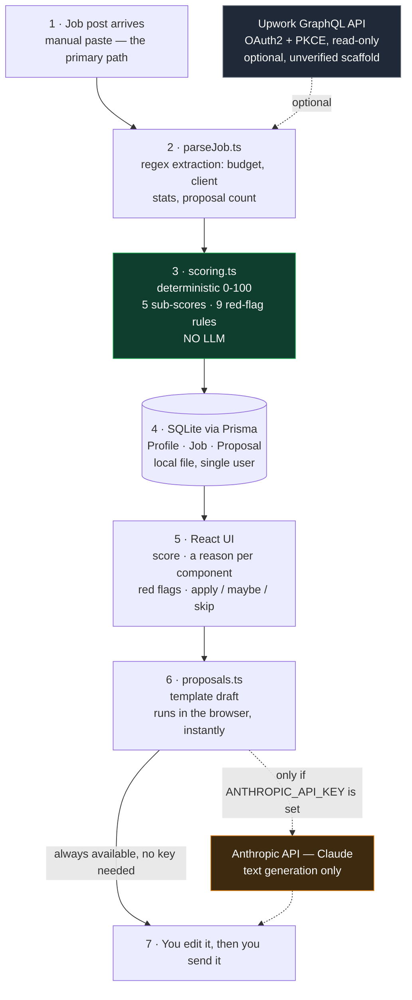

# UpRank — a decision engine for choosing which jobs to bid on

**The problem, in one line:** freelancers waste their best hours writing proposals for jobs they were never going to win.

On Upwork you pay to apply. Every bid costs Connects, and most bids are spent on
posts that are underpriced, already saturated, or outright scams — the kind of
thing you can only spot after reading the whole post carefully. Do that thirty
times a week and the reading itself becomes the job.

UpRank is the tool I built for myself to make that triage fast and consistent. You
paste a job post; it returns a 0–100 score, the reason behind every point, the
scam signals it found, and a verdict: **apply now / maybe / skip**.

> Personal tool, built and used by me. Not affiliated with Upwork. It has one
> user, so there are **no adoption metrics in this case study** — see
> [What is not measured](#what-is-not-measured).

---

## What it does, from the user's side

You open a local web app with nine sections in the sidebar. Four of them carry
the product:

| Screen | What you actually do |
|---|---|
| **Rank jobs** | Paste a job post. Get a 0–100 score broken into five components, a plain-language reason for each, a red-flag list, and an apply/maybe/skip verdict. |
| **Proposals** | Pick a scored job, choose a proposal framework, and get a 150–200 word draft with `[brackets]` where only you can fill in a real number or link. Instant from templates; optionally rewritten live by Claude. |
| **Profile audit** | Edit your headline, overview, skills, rate and portfolio and watch a six-category score update live, with a "fix this first" list. |
| **Upwork integration** | Connect a read-only Upwork API app over OAuth2 + PKCE, or read the page that explains exactly which automations are allowed and which get you banned. |

The other five (dashboard, strategy playbook, profile archetypes, prompt library,
settings) are an overview and reference content, not machinery.

Two things shape the whole experience:

1. **You always send. The tool never does.** Nothing is submitted to Upwork by
   UpRank. It ranks, drafts, and hands you text to review. That is a design
   constraint, not a missing feature — see [The ToS boundary](#the-tos-boundary).
2. **It works with no API keys at all.** With no `ANTHROPIC_API_KEY`, ranking,
   scam detection, the profile audit and template proposals all still work. The
   key only unlocks live text rewriting. Every AI button is labelled `(sin key)`
   when the key is absent instead of failing at click time.

### Screenshots

All five screens below are the real running app, captured from a production
build. The data in them is **synthetic** — job posts I wrote to exercise the
engine, and a placeholder profile. Every score shown was computed by the app, not
written by hand. Details in [`screenshots/README.md`](screenshots/README.md).

| | |
|---|---|
| [`02-job-ranking.png`](screenshots/02-job-ranking.png) | **The core screen.** Four job posts scored 92 / 92 / 42 / 0, with the score breakdown expanded on the top result and seven red flags on the scam post |
| [`03-proposal-draft.png`](screenshots/03-proposal-draft.png) | A 154-word template draft generated with no API key |
| [`04-profile-audit.png`](screenshots/04-profile-audit.png) | The live six-category rubric scoring a profile at 91 |
| [`05-compliance.png`](screenshots/05-compliance.png) | The allowed/forbidden page — the compliance rules written into the product itself. Note: its "what it does" card describes the envelope the ToS permit (webhooks included); the webhook receiver itself is not built. |
| [`01-dashboard.png`](screenshots/01-dashboard.png) | The overview: jobs analysed, how many rated *apply now*, average score, profile health |

> The interface is in Spanish. I built it for my own daily use and never
> localised it. The generated proposals and profile copy are in English, because
> that is what gets sent to clients.

---

## Architecture

Read it as one pass: **a job post arrives** (pasted, or pulled read-only from the
official API), **plain code parses and scores it**, **the result is persisted
locally**, **the UI shows the reasoning so you can overrule it**, **Claude is
called only to write prose**, and **you send it yourself**.

The full diagram, the data model derived from `prisma/schema.prisma`, and the
module map are in [`architecture.md`](architecture.md).

---

## One hard call: there is no LLM in the ranking engine

The obvious build for "score this job post 0–100" in 2026 is to send the post to a
model with a rubric in the system prompt and parse a number out of the response.
It is less code, it ships sooner, and in a project that already depends on Claude
it costs nothing extra to reach for. **UpRank does not do that.** The ranking
engine is 162 lines of ordinary TypeScript — five pure scoring functions and nine
regex red-flag rules — with the model kept out of the decision entirely.

**What the discarded option would have been better at.** The LLM version reads
nuance that regex cannot. It
understands that "we're a growing DTC brand" implies a budget, catches a scam
phrased in a way I never anticipated, and needs no maintenance when Upwork
changes its post layout. My rule-based version misses all of that. `parseJob.ts`
is regex over an English-language post format: give it an unusual layout and it
silently returns nulls, which the engine treats as "unknown" and scores neutral.
That is a real, permanent weakness of the choice I made.

**Why the rule-based engine won anyway.** Four reasons, heaviest first:

1. **A score you can't audit is a score you won't trust.** This tool tells me to
   skip jobs. If it says `62` and I disagree, I need to know which component was
   wrong. The engine returns the five sub-scores and a sentence per component —
   translating two real ones from the Spanish UI: *"High hourly rate (~$80/h)"*
   and *"Low hire rate (12%) — posts a lot, hires little"*. So I can see where the
   disagreement is and overrule it. An LLM score with a
   generated justification gives me a *plausible* explanation, not the actual
   cause of the number. When I stopped trusting it, I'd have nothing to inspect.
2. **The same post must always produce the same score.** Ranking is a comparison
   across a list. If re-scoring drifts, the ordering drifts, and the sorted list —
   the entire point of the product — stops being stable. Pure functions give me
   this for free.
3. **It costs nothing and takes no time.** Triage is high-volume and low-value per
   item; that is exactly the shape of work that should not carry a per-item API
   call. Scoring runs synchronously in the request handler with no key, no
   latency, no spend, and no rate limit. It is also why the app is fully useful
   with zero credentials configured.
4. **Job posts never leave the machine.** Client budgets and hiring history stay
   in a local SQLite file. Nothing is sent to a third party to produce a number I
   can compute locally.

**A second-order payoff.** Because the engine is pure functions over
plain objects with no I/O, the exact same module runs on both sides of the wire.
`profileAudit.ts` is imported by the server component at `src/app/page.tsx:5` to
render the dashboard's profile health, *and* by the browser at
`src/components/ProfileClient.tsx:44`, inside a `useMemo`, so the six category
scores update as you type in the overview box. Template proposals work the same
way — `ProposalsClient` imports `parseJob` and `renderProposalTemplate` and runs
them locally, which is why a draft appears with no spinner and no request. None of
that is possible with a model behind an API: live-as-you-type feedback would mean
a call per keystroke. Determinism was chosen for auditability; isomorphic
execution came with it.

**Where the LLM does belong, and why that's the same judgement.** Claude writes
the proposal draft and rewrites the profile overview. Those tasks are the mirror
image: the output is prose, there is no single correct answer, quality is
subjective, variation is a feature, and a human reads every word before it goes
anywhere. Text generation earns the API call. Scoring does not.

If I'm honest about the cost of this decision: the weights (25 pay / 20 client /
25 fit / 15 intent / 15 competition) and the rubric thresholds are my judgement,
tuned by hand. They have not been validated against actual win rates, because I
don't have enough outcome data to validate them with. They are a defensible
starting point, not a proven model.

---

## Stack

| Layer | Choice | Why |
|---|---|---|
| Framework | Next.js 15 (App Router), React 18 | Server route handlers and UI in one deployable; scoring runs server-side |
| Language | TypeScript 5.7 | The scoring engine is pure, typed functions |
| Database | SQLite via Prisma 6 | Single user, local file, zero infrastructure |
| Styling | Tailwind CSS 3.4 | — |
| LLM | Anthropic SDK (Claude) | Text generation only, behind a capability check |
| Upwork data | Official GraphQL API, OAuth2 + PKCE, read-only | The only permitted programmatic path |
| Validation | Zod | Route handler input |

~1,600 lines of application code across `src/lib` and `src/data`. Builds clean:
`npm run build` compiles 22 routes (9 pages, 12 API route handlers, plus the
not-found page) with no errors.

---

## The ToS boundary

Upwork's automation policy is simple to state and easy to violate by accident:
**automation may prepare and assist, but a human must decide and send.** Bidding
tools that scrape the marketplace or auto-submit proposals get accounts banned,
and for a freelancer the account *is* the business.

So the boundary is enforced in the architecture, not in a disclaimer:

- **Job data enters by manual paste, or by the official read-only GraphQL API.**
  There is no HTML parsing of `upwork.com`, no headless browser, no scraping
  library in the dependency tree, and no use of the user's logged-in browser
  session. The stored job `url` field is persisted for your reference and is never
  fetched.
- **The only outbound calls to Upwork** are the documented OAuth2 token endpoint
  and `api.upwork.com/graphql`. The GraphQL queries are read-only: search jobs
  matching your own filters, read your own proposals, read your own Connects
  balance.
- **There is no code path that submits a proposal.** Not disabled — absent. The
  app's final action is putting text on your clipboard.
- **The rules are a screen in the product**, not a footnote: the compliance page
  lists what the tool does and what it will never do, including caching limits and
  polling behaviour.

This was a fixed requirement from the first commit, not a decision made along the
way. It shaped the product: because the official API needs an approval that can
take two weeks, the entire tool had to be useful with no API access at all. That
is why the primary input is a paste box, why ranking runs locally, and why nothing
in the app is gated behind a credential. Designing for the permitted path first,
rather than retrofitting compliance later, is what made the constraint cheap.

---

## What is not measured

Honesty about limits, because a portfolio that overstates is worse than a small
one that doesn't:

- **No usage metrics, and there won't be any.** One user. No conversion data, no
  win-rate comparison, no "N× faster". The scoring weights are unvalidated
  judgement calls, as noted above.
- **The Upwork API integration has never run against the live API.** The OAuth2 +
  PKCE flow, token refresh and cookie handling are implemented and compile; the
  GraphQL queries are written against the published schema but are **unverified**,
  and the source file says so in a comment. An Upwork API key requires manual
  approval that takes up to two weeks. Until then, manual paste is not the
  fallback — it's the path that actually works.
- **There is no test suite.** `package.json` has no test script. This is the gap I
  find hardest to defend, because `scoreJob()` is a pure function over a plain
  object — the single most testable thing in the codebase — and the red-flag rules
  are nine regexes that deserve fixture cases. It is the first thing I would add.
- **One known rendering bug.** `src/components/JobsClient.tsx:16` calls
  `toLocaleString()` with no explicit locale, so Node and the browser format the
  same number differently and React logs a hydration mismatch. You can see it in
  `screenshots/02-job-ranking.png`: the client-spend figure reads `$150.000` in
  the header and `$150,000+` in the breakdown below it. One-line fix, left visible
  here rather than quietly patched for the screenshot.
- **Single-user by design.** No authentication, no multi-tenancy, local SQLite
  file. Making it multi-user is a rewrite of the persistence layer, not a feature
  toggle.
- **The market statistics on the dashboard** come from bundled research content,
  not from measuring this app. The app carries a sources list on the strategy
  page, but the dashboard numbers are not individually attributed to a source —
  they are reference material, not results.

---

## What this project is evidence of

Not that a tool got traction — it didn't, and I'm not claiming it did. What it
shows is a full-stack AI product shipped end to end by one person: a data model,
a deterministic decision engine, an LLM used narrowly and behind a capability
check, a graceful zero-credential mode, and a compliance constraint treated as an
architectural boundary instead of a paragraph in a README.
