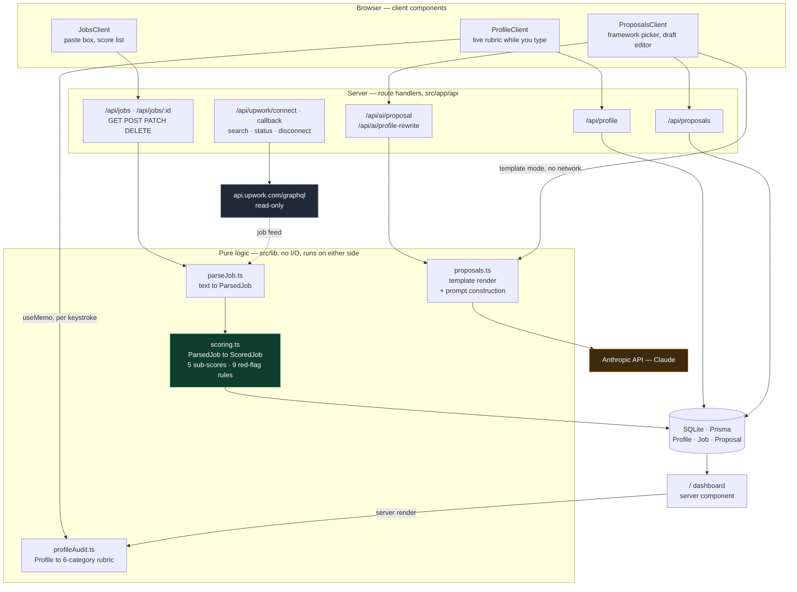
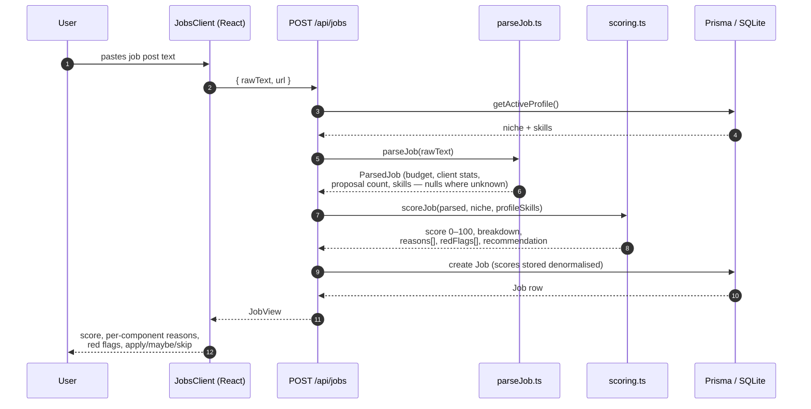
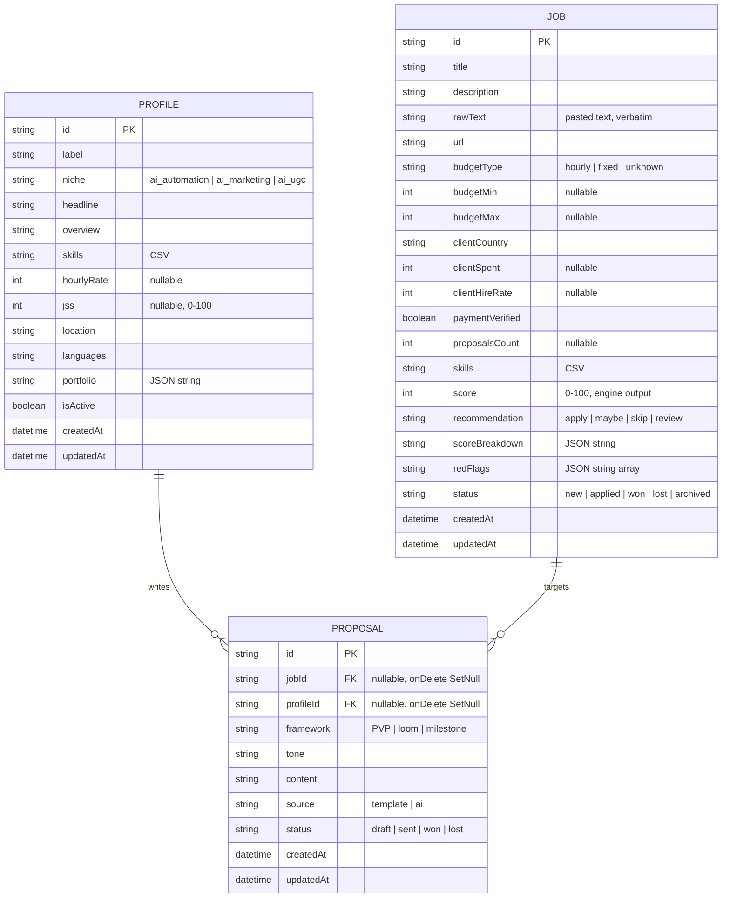
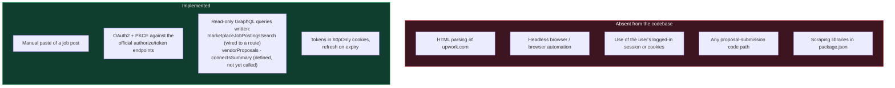

# UpRank — architecture

Companion to [`README.md`](README.md). Everything here is derived from the source:
the data model is read off `prisma/schema.prisma`, the route list off the
production build output, and the module map off `src/`.

---

## 1. System diagram

**The line that matters:** `scoring.ts` and `profileAudit.ts` sit in the pure-logic
layer and never touch `claude` or `upwork`. They are synchronous functions over
plain objects. Only `proposals.ts` reaches the model, and only to generate prose.

**Note the two edges into `profileAudit.ts`.** The same module is called by the
server component at `src/app/page.tsx:5` and by the browser at
`src/components/ProfileClient.tsx:44`. Having no I/O in the logic layer is what
makes that legal, and it is why the profile score can update on every keystroke
without a request. `proposals.ts` template rendering is client-side for the same
reason; only the Claude path crosses to the server.

Reference content in `src/data` (3 niches with keyword sets and rate ladders,
3 proposal frameworks, 22 archetypes, 11 prompts, a strategy playbook with cited
sources) is imported directly by the logic modules. It is static TypeScript, not a
database table.

---

## 2. Request lifecycle — ranking one job

No network call leaves the machine anywhere in this path. That is why ranking
works with zero credentials configured.

### Scoring components

| Component | Max | Inputs |
|---|---:|---|
| Pay | 25 | Hourly rate or fixed budget, banded |
| Client | 20 | Payment verified, total spent, hire rate |
| Fit | 25 | Niche keyword overlap, premium keywords, your own skills |
| Intent | 15 | Description length, scope/deliverable words, long-term signals |
| Competition | 15 | Proposal count (fewer is better) |
| **Total** | **100** | |

Red flags are scored separately: 9 regex rules, each subtracting 20 (severe) or 6
(minor) from the total, floored at 0. A severe flag combined with a score under 70
forces `skip` regardless of the sub-scores. Verdict thresholds: `≥75 apply`,
`≥55 maybe`, otherwise `skip`.

---

## 3. Data model

Three tables, derived verbatim from `prisma/schema.prisma`.

### Three modelling notes

**Arrays are CSV, objects are JSON strings.** `skills`, `portfolio`,
`scoreBreakdown` and `redFlags` are all `String` columns. Prisma's SQLite
connector has no native array or JSON scalar, so serialisation is explicit and
lives in one place — `src/lib/serialize.ts` (`csvToArr`, `arrToCsv`, `jobToView`).
The trade-off accepted: you cannot query inside those fields in SQL. Nothing in
the app needs to, because the working set is one person's job list.

**Scores are stored, not recomputed on read.** `score`, `recommendation`,
`scoreBreakdown` and `redFlags` are persisted on the `Job` row at insert time.
This makes the list view a single indexed read (`orderBy: [score desc, createdAt
desc]`) with no scoring pass. The cost is that changing the engine's weights does
not retroactively rescore stored jobs — an accepted staleness, since a stable
historical ranking is more useful here than a self-updating one.

**`rawText` keeps the original paste.** Parsing is lossy and regex-based, so the
source text is retained verbatim. It is what red-flag rules run against, and it is
what proposal generation reads — so a parser miss degrades the score without
destroying the input.

**Nullable means unknown, not zero.** `budgetMin`, `clientSpent`,
`clientHireRate` and `proposalsCount` are all nullable, and the engine scores
`null` as a neutral mid-band rather than a penalty. A post that simply doesn't
state its budget should not be punished as if it stated a bad one.

---

## 4. Module map

| Path | Lines | Responsibility |
|---|---:|---|
| `src/lib/scoring.ts` | 162 | The ranking engine. Pure. 5 sub-scores + 9 red-flag rules. |
| `src/lib/proposals.ts` | 171 | Template rendering, portfolio matching, Claude prompt construction. |
| `src/lib/profileAudit.ts` | 167 | 6-category weighted profile rubric + rewrite prompt. |
| `src/lib/parseJob.ts` | 120 | Regex extraction from pasted post text. Tolerant: unknown → `null`. |
| `src/lib/serialize.ts` | 90 | DB row ↔ view model; CSV/JSON field handling. |
| `src/lib/upwork/oauth.ts` | 94 | OAuth2 + PKCE, token exchange/refresh, GraphQL transport. |
| `src/lib/upwork/queries.ts` | 61 | Three read-only GraphQL queries. **Unverified against the live API.** |
| `src/lib/anthropic.ts` | 42 | Claude client + `hasAnthropicKey()` capability check. |
| `src/lib/types.ts` | 52 | Shared types. |
| `src/lib/db.ts` | 12 | Prisma singleton. |
| `src/lib/profileStore.ts` | 17 | Active-profile accessor; creates a default on first run. |
| `src/data/*.ts` | 632 | Reference content: 3 niches, 3 frameworks, 22 archetypes, 11 prompts, strategy playbook with a sources list. |

Roughly 1,600 lines of application code. The UI adds `src/components` (6 client
components) and `src/app` (9 pages, 12 route handlers).

### Capability checks, not crashes

Two environment-driven capabilities, both surfaced through `/api/status`:

| Capability | Gate | Behaviour when absent |
|---|---|---|
| Live text generation | `ANTHROPIC_API_KEY` | Buttons render labelled `(sin key)`; template mode produces the draft; `/api/ai/*` returns `409` and the UI points at the prompt library for copy-paste into any chat model. |
| Upwork API import | `UPWORK_CLIENT_ID` + `UPWORK_CLIENT_SECRET` | Connect redirects to `/integracion?error=config`; manual paste is unaffected. |

The app has no required environment variable except `DATABASE_URL`.

---

## 5. The compliance boundary, in code

Verifiable in the source:

- The only `fetch()` calls to an Upwork host are in `src/lib/upwork/oauth.ts`:
  the token endpoint (twice, exchange and refresh) and `api.upwork.com/graphql`.
  The authorize URL is a browser redirect, not a server call.
- `package.json` dependencies are: `@anthropic-ai/sdk`, `@prisma/client`, `clsx`,
  `lucide-react`, `next`, `react`, `react-dom`, `zod`. No Puppeteer, Playwright,
  Selenium, Cheerio or JSDOM.
- The `Job.url` column is written and displayed but never fetched.
- Cookies named `uw_access` / `uw_refresh` hold tokens the user obtained through
  the documented OAuth flow. No Upwork session cookie is ever read.

---

## 6. Known architectural weaknesses

Listed here rather than in a "future work" section, because they are consequences
of choices already made.

1. **No tests.** `package.json` has no test script. `scoreJob()` and `parseJob()`
   are pure functions with fixture-shaped inputs and are the obvious first target.
2. **The GraphQL queries are unverified.** Written against the published schema,
   never executed against the live API — an API key needs manual approval from
   Upwork. `src/lib/upwork/queries.ts` carries a comment saying exactly this.
3. **Hydration mismatch.** `src/components/JobsClient.tsx:16` uses
   `toLocaleString()` with no locale argument, so server and client render
   `$150.000` and `$150,000`. One-line fix; visible in the screenshots.
4. **The parser is format-coupled.** `parseJob.ts` targets the English Upwork post
   layout. A layout change degrades scores silently toward neutral rather than
   failing loudly — safe, but invisible.
5. **Weights are unvalidated.** The 25/20/25/15/15 split and the audit rubric
   thresholds are hand-tuned judgement, not fitted to outcome data.
6. **Single-tenant.** No auth, no user scoping; `getActiveProfile()` returns the
   first active profile. Multi-user means reworking persistence, not adding a
   flag.
